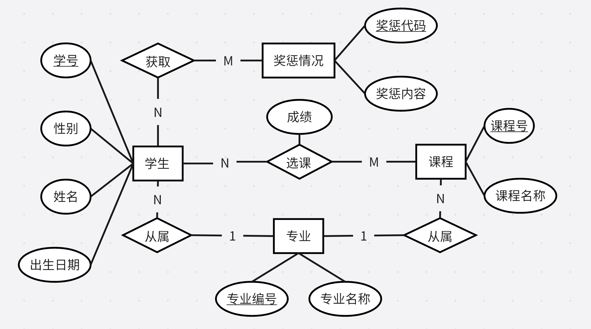

## 数据库需求分析

**PB21000047 左桑贝**

### 课题

学籍管理系统

### 需求分析

1. 记录学生的基本信息（姓名、性别等）
2. 实现学生专业的变更以及查询（专业代码，专业名称等）
3. 实现学生奖惩情况的更新以及查询（奖惩代码，奖惩内容）
4. 支持学生选课，记录每位学生在他（她）所选的每门课程的成绩（建立多对多索引）
5. 查询学生的专业内课程平均成绩，专业外课程平均成绩等等

### 概念设计（ER模型设计图）

***方便起见，下面将关系模型设计也一并完成，并将其作为 ER 模型设计的辅助信息***

涉及学生基本信息、专业变更、奖惩情况、课程管理、课程成绩等相关实体。

实体转换得到关系模式：

1. **学生**（<u>学号</u>，姓名，性别，出生日期）
2. **专业**（<u>专业编码</u>，专业名称）
3. **课程**（<u>课程号</u>，课程名称）
4. **奖惩情况**（<u>奖惩代码</u>，奖惩内容）

考虑每个联系：

1. **学生:专业（N:1）**：**学生**（<u>学号</u>，姓名，性别，出生日期，<u>专业编码</u>）
2. **课程:专业（N:1）**：**课程**（<u>课程号</u>，课程名称，<u>专业编码</u>）
3. **学生:课程（N:M）**：增加模式 **学生_课程**（<u>学号</u>，<u>课程号</u>，课程成绩）
4. **学生:奖惩（N:M）**：增加模式 **学生_奖惩**（<u>学号</u>，<u>奖惩代码</u>，获取时间）

ER 模型图如下：

